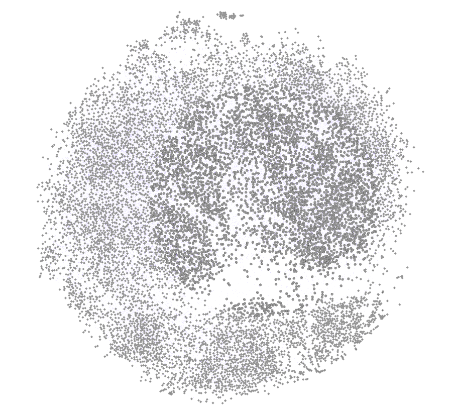

# Word Ladder Solver - Algoritmo A* (Parte 1)

Este projeto tem como objetivo final desenvolver um resolvedor automático para o **Word Ladder** (escada de palavras) utilizando o algoritmo de busca **A* (A-Star)** para encontrar o caminho mais curto entre duas palavras.

Esta é a **Parte 1** do projeto: a construção do grafo com todas as possibilidades de conexão entre as palavras.

## 🎯 O Objetivo do Word Ladder
O desafio do \"Word Ladder\" consiste em transformar uma palavra em outra, mudando apenas uma letra por vez, onde cada passo intermediário deve ser uma palavra válida de 5 caracteres. O algoritmo A* será utilizado para encontrar essa sequência de forma otimizada.

## 📊 O Grafo de Palavras
Para que o algoritmo A* possa navegar entre as palavras, construímos um grafo onde:
- **Nós:** São todas as palavras válidas de 5 caracteres da base de dados.
- **Arestas:** Uma conexão (aresta) é criada entre duas palavras se elas diferem por **apenas uma letra** na mesma posição. Por exemplo, \"casa\" e \"cala\" estariam conectadas.
- **Formato:** O grafo é gerado no formato **GEXF**, um padrão otimizado para visualização em softwares como o **Gephi**.

### Visualização do Grafo
Abaixo, a representação visual das conexões entre as palavras gerada no Gephi:




## 🗄️ Base de Dados
A base de dados de palavras (`database.py`) foi obtida a partir do repositório público:
- **Fonte:** [termooo-solver](https://github.com/vgarciasc/termooo-solver)
- **Autor:** [vgarciasc](https://github.com/vgarciasc)

Esta lista contém aproximadamente **10.589 palavras de 5 caracteres**, sem a utilização de acentos ou outros caracteres especiais, garantindo a compatibilidade com o desafio do Word Ladder.

## 🚀 Como gerar o Grafo (Parte 1)
1. Instale as dependências listadas em `requirements.txt`: `pip install -r requirements.txt`
2. Execute o script `CreateGrafo.py` para gerar a matriz de adjacência (`grafo_result.txt`).
   ```bash
   python CreateGrafo.py
   ```
3. Em seguida, execute o script `PlotGephi.py` para criar o grafo no formato GEXF, utilizando a matriz gerada.
   ```bash
   python PlotGephi.py
   ```
4. Um arquivo chamado `grafo_word_ladder.gexf` será criado em seu diretório.

## 🛠️ Visualização no Gephi
Para explorar visualmente o grafo gerado:
1. Abra o Gephi.
2. Vá em `File > Open` e selecione o arquivo `grafo_word_ladder.gexf`.
3. Utilize os algoritmos de layout (como ForceAtlas 2) para organizar os nós e identificar clusters de palavras.(use dimensinamento 500 e gravidade 0.1)

## ⚠️ Nota sobre Geração de Arquivos
O script `CreateGrafo.py` gera o arquivo `grafo_result.txt` (matriz de adjacência), que possui cerca de **213MB**. Devido ao seu tamanho, este arquivo está listado no `.gitignore` e não será incluído no repositório. O script `PlotGephi.py` então processa essa matriz para criar um arquivo `grafo_word_ladder.gexf` otimizado e muito mais leve para visualização no Gephi e para ser versionado.


